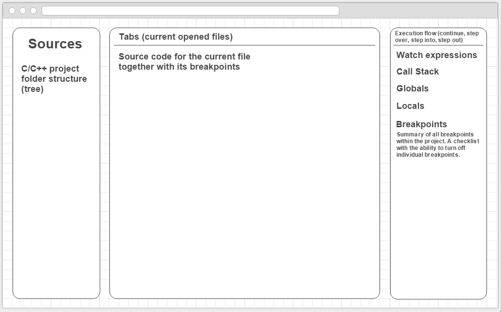

Hi! Since this is the first post, let me introduce myself. My name is Alexander Baygeldin, I'm a student of the Saint-Petersburg State University and this summer I'll work on the web GDB frontend project for Mozilla as part of Google Summer of Code 2016. In this blog I will publish my weekly reports (it's the requirement of the project). By the way, English is not my native language, so sorry in advance for mistakes and typos. Anyway, I hope I'll be able to explain everything understandable. So, let's start! :)  

In this project the goal is to provide a GUI for GDB in the browser so that other developers can use it to easily and intuitively debug projects running in a cloud environment. You can read more about it on the [about page](about). Here I'll focus on the architectural design of the project and some things and investigations that I've done during community bonding period.  

## Project Proposal

> **Disclaimer:** this is the dense retelling of the project proposal, so feel free to skip it if you're already familiar with it.

Basically, this project is a Single Page Application which, when given a link to the WebSockets server, provides a web-interface to interact with GDB by processing stdin/stdout/stderr streams from it. It’s just a static page and all it needs to work is a link to the WebSocket server which can be implemented quickly in any language (Go, JavaScript, Ruby, etc.). So, react-gdb is server
agnostic and can even be run on the GitHub pages :) Conceptually, I see the GUI like this:  

   

The framework of choice for this project is React/Redux. This is the perfect choice for this kind of project since the GUI can be very well represented as a function of GDB state. However, it’s better to keep the logic for GDB streams processing outside of React application to maintain a good separation of concerns and make sure our application knows as little as possible about GDB. It’s possible by creating a GDB abstraction. I see the project architecture like this:  

   

The abstraction should accept actions, process them, and forward them to the server. And it should also maintain its state (i.e. current file, current line of code, backtrace, locals, etc.) and notify our application every time it changes. This will lead to the
painless synchronization with the actual state of GDB. So, the react application will concern only about how things look and will maintain an UI state within it, while GDB abstraction will maintain the state of GDB and will know how to work with it. This will let me to implement the parts of the project step-by-step, independently and will allow to easily test everything thanks to loose coupling.

## Investigations

During community bonding period I've set up an initial environment and made myself familiar with `docker-exec-websocket-server` so that when the coding period starts I'll start actually coding. In this section I'll try to reveal more detail about it.  

The project actually contains three abstractions: thing for piping process streams through WebSockets, GDB abstraction and finally a web application (UI). Since the first two abstraction can be useful outside of the project I decided to make separate repositories for them. It also will allow me to develop and test them independently. So, in the end I expect to have three separate npm packages. The client side app will have first two packages as dependencies. However, it absolutely won't affect the ease of development and I won't have to update npm packages everytime I change something in the dependencies, because I use git submodules together with `npm link`. With this approach I can develop separate npm packages simultaneously and once any of them become solid I can easily get rid of the related git submodule and require it as a typical npm dependency (it will require no changes to the code). Okay, so let's move to the abstractions.

### [ws-exec](https://github.com/baygeldin/ws-exec)
When I was playing with `docker-exec-websocket-server` I found out that it's not optimised for browser use and it's not working out-of-the-box without some tweaking. I considered making a PR, but decided to create a separate repo. The main reason for this is that I wanted to make the debugger able to use with local projects, and having a dependency for Docker is not a good user experience. So, the main idea was to generalize the `docker-exec-websocket-server`. The good news is that protocol it uses is very common (not docker specific) so it's actually easy to keep `ws-exec` compatible with `docker-exec-websocket-server`. In fact, it should be possible to rewrite `docker-exec-websocket-server` using `ws-exec` (I kept that in mind when I was writing `ws-exec`), but first it needs some (maybe lot) refactoring and tests. So, I'll leave it for later since client side part of `ws-exec` is already working well with server side part of `docker-exec-websocket-server`. Also, when I was studying the sources of `docker-exec-websocket-server` I understood how back-pressure is implemented there and why it's necessary. 

### [gdb-js](https://github.com/baygeldin/gdb-js)
The second abstraction is GDB/MI wrapper. It accepts process streams (e.g. produced by `ws-exec`) and provides a handy interface to GDB. There are such wrappers already, however none of them suit this project. The first drawback of them is that they do not accept streams and hence not usable in the browser environment. The second drawback (and the main one) is that they do not maintain a consistent state of GDB. In this project we *need* to have state of GDB since after every action the current file, current line of code, call stack, locals, globals and many other things can change. Handling all of these in the client-side app is error-prone and just a bad separation of concerns. So, the GDB wrapper should maintain the state itself and provide handy events for notifying the application on every state change. With such wrapper writing the UI will be **much** easier. So, as stated in my timeline, I will focus on this part of the project for a while. And I'll start with writing tests. This is a perfect project for practicing BDD :)

### [react-gdb](https://github.com/baygeldin/react-gdb)
Finally, we're here :) It's the main goal of this project — the GUI. It's specific for GDB and relies on the protocol `ws-exec` uses, but one of the core ideas is that these parts should be easily swappable. And it's definitely possible since `gdb-js` and `ws-exec` are decoupled from the application itself. Basically, `react-gdb` is just a static site, but for convenience it'll be also published on npm (without dependencies since it's just a static assets). At this stage of the project there's no React/Redux here. I'll start to use them once `gdb-js` starts to become solid. However, the environment for this is ready: the demo server that runs docker container, docker image and configured webpack. Here's a quick example of how `ws-exec` and demo server are glued together within `react-gdb`: 

   

Also, I was experimenting with using webpack for bundling npm packages and backend, but understood that it wasn't a good idea :P Webpack wasn't designed for this type of things. That being said, I had experience with webpack before, but I think that I finally got the philosophy behind it only recently. Here're some things that I've understood:

* npm is not made for minified and bundled versions! It's conceptually wrong to publish such packages. CDN is for minified versions.
* The developer himself should worry about the final bundle size, not the package maintainer. Hopefully, it's done very easily with `IgnorePlugin`, `ContextReplacementPlugin`, `null-loader` and `display-all-modules` option. However, the package maintainer should denote which dependencies can be turned off without affecting his package (individually for browser environment, node environment, production mode and debug mode).

## P.S.
I decided to write things that are not strictly related to the project, but related to the GSoC, in the postscriptum section. And here're some of these things:  

* WHY there're so much fish in the header of the blog? Well, it's because the official mascot of GDB is a fish (archerfish to be precise). But I couldn't find a good picture with archerfish, so I decided to leave this one (it's pretty nice, isn't it? :)) 

> For a fish, the archerfish is known to shoot down bugs from low hanging plants by spitting water at them.

* This blog is powered by harp (a static site server with built-in pre-processing). It's not a static-blog engine but it turned out that it's very handy for this and it's also very flexible. I encourage everyone to give it a try!
* This and the next months (May and June) are very busy due to the exams, but I took it into account when I was planning my timeline. Actually I feel optimistic about this project and I believe I will finish the `gdb-js` before midterm and start doing the UI. So, let's start! :)

```javascript
console.log('Hello World!')
```


