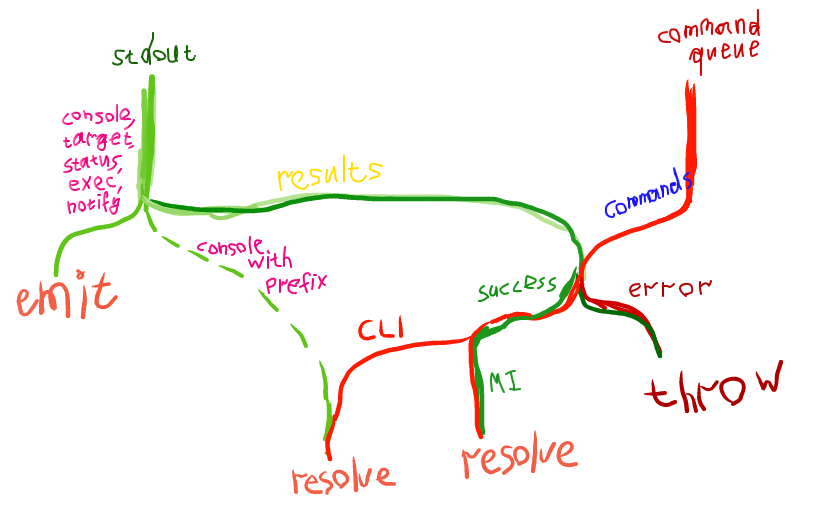

# Milestone

Weekly reports are slowly turning into fortnightly reports, heh. But despite this I'm satisfied with the progress. During this time I managed to finish `gdb-js`, write documentation for it, publish it on npm and set up CI. Also, I fixed the `ws-streamify` and puzzled out the debugging of multithreaded and multi-process'ed targets in GDB and added the corresponding examples to `gdb-examples` repo. But what's more important — I've finally acquired a good understanding of how the project should be implemented. And in the meantime I've passed another exam :D But let's see it in a little more detail.

## Multithreading
Honestly, I hate multithreading :D Except maybe its application to pure functional languages. But for everything else it just sounds scary to me. Deadlocks, unobvious control flow... That's why I like event-loop. And that's why I deliberately avoided this topic while I was writing `gdb-js`. But it couldn't be postponed forever, so I created a simple yet handy example of multithreaded program for `gdb-examples` repo: multiple ticket-sellers sell tickets simultanously until there's no tickets remain. And while playing with it in GDB I understood that `non-stop` and `target-async` modes are must have in a GDB frontend. So i included them in `gdb-js` and then added `thread` argument to all of the methods where it makes sense. That's it.

## Multiple targets
First off, I read [how it works in Chromium](http://blog.chromium.org/2008/09/multi-process-architecture.html) and then [how it's coming to Firefox](https://blog.mozilla.org/addons/2016/04/11/the-why-of-electrolysis/). From these articles I understood how important it is to have a multi-process architecture and thus it's neccessary to have the ability to debug it. However, unlike threads when a process is created it's not attached to GDB automatically. The exception to this is only systems that support `fork` and `vfork`. On other systems (e.g. [Windows](https://msdn.microsoft.com/en-us/library/ms682425.aspx)) I believe it should be done manually. But even in this case [it seems that it's not that straight-forward](https://sourceware.org/gdb/onlinedocs/gdb/Forks.html). So I decided to just add methods for attaching and detaching processes to `gdb-js` and a method that disables `detach-on-fork` mode, so that forks will be attached automatically. Also, I've created the example of a program with multiple processes (multiple counters) and pushed it to `gdb-examples` repo.

## Python and CLI commands
In previous post I said that MI interface is lacking some commands. But GDB allows to use CLI commands in MI mode with `-interpreter-exec console`. The only problem with it is getting the results. So I decided to make use of Python and its function `gdb.execute("<CLI command>", False, True)`. In GDB >= 7.3 it has a third argument which when `True` returns a string with results of CLI command execution. So I wrapped it into an useful command `concat` which executes given CLI command, adds a given prefix to the results of command execution and prints this in a single MI console record. Also, I've created a command `info context` which takes all variables (globals, static, locals) in the current context and prints a nice JSON. However, getting all (I mean, ALL) globals for the current target is only possible with manually parsing of its symbol table. So I just decided to write one another pegjs parser for the results of `info variables` command. It all works pretty well. Besides we now have a nice infrastructure to add new functionality to GDB without even bothering the server. However, scripts can be (from my experience) only ~3700 symbols long. Maybe it makes sense to make use of `pyminifier`. To summarize, this is how I manage the results handling now, it's an exact copy of the actual flow in the code (I sooo love streams):

   

## gdb-js
[Here's](https://travis-ci.org/baygeldin/gdb-js) Travis CI. [Here's](http://npmjs.com/package/gdb-js) the npm package. [Here's](https://baygeldin.github.io/gdb-js) the documentation. I considered several documentation generators, but then just decided to use JSDoc. Although I also like Docco and its [literate programming philosophy](https://en.wikipedia.org/wiki/Literate_programming). 

## react-gdb
Finally, the most important part. Thanks to @jonasf I finally realized the core goals that the project is pursuing and how it should be implemented to fit these goals. Back then I thought that `react-gdb` is just a static site that needs a link to the WebSocket server to work. This made me think that `react-gdb` is something that has dependency on the server (and its protocol, of course). But in fact, it's just a React component that can have a much simpler interface (almost the same as `gdb-js` has). It can accept a child process (e.g. an instance of `docker-exec-websocket-server`), source provider and (optionally) debug log provider. Source provider can be implemented as a plain function that accecpts a file name and returns the sources of this file (for Firefox, it can be a hg repository provider, for example). This interface will make `react-gdb` absolutely server-agnostic, agnostic about the location of sources and reusable. So, that's it. By the way, I've also put a lot of thought on how the UI should look like when I add multithreading and multiple targets support to it. I've ended up with something similar to NetBeans approach (with the amendment that I want to group threads by a process):

<video controls="controls">
  <source src="assets/other/netbeans-multithreaded-debugging.mp4">
</video>   

## P.S.
* As for `ws-streamify` it now merges the buffers into one message when it's possible.
* I've spent some time on improving my vim workflow with a bunch of useful plugins and now I regret not doing it earlier т\_т.
* I have an exam on 24th of June. So, I will continue my work on the project after it.
