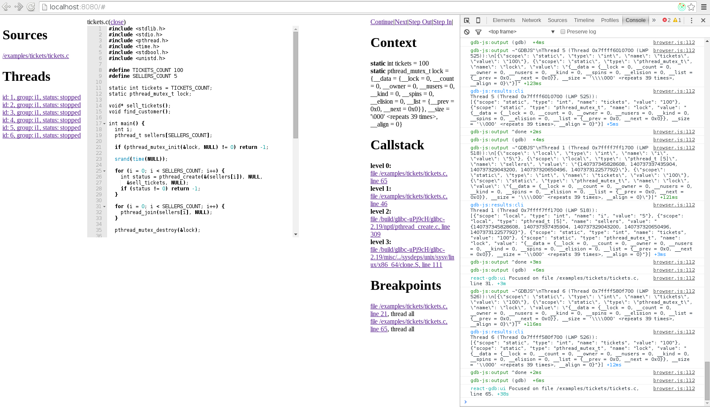

# Shaping

In the previous post I told about initial scaffolding of the GUI and this week I've been working on making the project architecture more solid, adding new features, fixing bugs. Unfortunately, I somehow managed to catch a cold in the high summer and it significally slowed me down. But anyway, I've run the demo application, now it looks like this:

In this post I'd like to talk about a lot of different things, but I'll try to avoid boring details in order to not make this post longer than it already is. So, let's start.

## UX
First, I'd like to outline the main functionality of the app and how it works (how I see it should work). Obviously, it should support file manager, multithreading, callstacks, variables, breakpoints, but the details of user interaction with all of this are not obvious at all, so here's how I see it:

* When user clicks on a thread, the current file for this thread is opened in the main area (the editor) and it focuses on the current line for this thread (i.e. the editor is focused on a current frame). The same happens when we click on a callstack level or a breakpoint and when the current thread is stopped for some reason (e.g. after stepping through the code). I haven't added this functionality to the ace editor yet, but everything else is working (everytime the editor should focus on the frame, the message is sent to console log). This feature is kind of unusual for Redux/React app since it doesn't ideally fit to the concept of "function of data" and using refs here is also not a good option since it complicates the code. So I created an additional field in the store for the focused frame. I pass this object as props to the editor and when it changes, the editor gets focused on the frame. I think that this is mostly reasonable approach.
* Application state is always associated with some thread and only related context, callstack and breakpoints are printed. Also everytime user sets a breakpoint it's applied only to the current thread. But setting and removing breakpoints that are applied to all threads is also necessary, so I decided that when user holds `Ctrl` and clicks on the gutter to set a breakpoint, breakpoint is set to all threads. Good news is that GDB is capable of doing all these things even for multiple targets that share the same code, however there're some bearable specifics.
* At the start no thread is selected and the debugging is not started yet. However, we can open files and set breakpoints that will be applied to all threads. Instead of "continue"  and "pause" buttons we see "run" button.  The first added thread gets selected automatically.
* Threads are grouped by their belonging to inferiors, but all of them are equal. Every thread has its status (stopped or running), every thread can be debugged separately. Also, when it's stuck (e.g. infinite loop) we can interrupt (pause) it and then continue, if we want.
* Current line (of the current thread frame) is highlighted in the editor.
* The sources are fetched only at the moment when you open them in the editor.

Almost everything here is ready (through the console or GUI), however some bugs are possible.

## Component design
Right now ReactGDB has this interface:
* A process with stdin, stdout and stderr Node.js streams.
* Source provider with two fields: "fetch" which is a function that accepts a fullpath to a file and returns a Promise that resolves with the source of this file, and "basePath" string that helps to distinguish between project and system files.
* Inferior provider is an EventEmitter with "fork" event that accepts callback and pass pid as the first argument to it. I really don't know how such provider should be implemented, but I also know that there's no way that ReactGDB can do it on its own (crossplatform). But with such provider working with multiple targets become really easy.

There's not much sense in changing these props in the runtime, so I decided to warn user when he changes the props and re-render whole app with new props. By the way, even if server rendering also makes no sense for ReactGDB, I was interested in how to create reusable components that at least not breaking anything when you try to render on the server. And it surprised me that I couldn't find any best practices and rules for it. After a little investigation I understood that the rule of thumb is actually pretty simple. Put all of asynchronous stuff and things that can trigger browser API to `componentDidMount` method. It's easy to follow and this is what I do.

## Build system
I believe that properly adjusted build system is the most important part of the project. No one needs a project that they can't build :) And well, build system that is fragile and slow is killing all motivation sometimes. So I spent some time optimizing speed and convenience of my build system. I'll spare you off boring details about optimizing speed (HappyPack, DLLPlugin, CommonsChunkPlugin, etc.), but I'd like to note that the best performance I achieved with just using multiple configurations. However, this config was very bloated and hardly maintainable, so I switched to a more concise one and made use of webpack-dev-server in order to serve bundles from memory and enable auto-refreshing. I'm fine with the current performance.  

Also, in the last post I said that CSS Modules are hard to customize and thus using single CSS file is more appropriate. I was wrong about theming, [it's actually pretty easy](https://github.com/css-modules/css-modules/blob/master/docs/theming.md) to do it even without webpack (however, webpack makes it super simple). But it wouldn't have been enough for me to switch over to CSS Modules. The thing I love about them is about keeping related things together. The decision to treat all static assets as modules is actually a killer feature of webpack even if it can seem a little strange from the first look. Keeping domain specific things together is very convinient and it also makes build system extremly flexible. I have two webpack configurations now, one for production and one for development. Production build makes a CommonJS module (without bundling dependencies, of course) and put it with its static assets to a `lib` folder. Development build makes two chunks: vendor chunk for all third-party dependencies and bundle chunk for gdb-js, react-gdb and example app (such separation makes build x5 times faster). It's notable that using webpack for all the things made it unnecessary to use `npm link`. However, development build depends on a specific version of `docker-exec-websocket-server` which is different from the npm version. But I've already [sent a PR](https://github.com/taskcluster/docker-exec-websocket-server/pull/7) and once new version is published it will build just fine. **UPDATE**: @jonasfj have merged it really quick and new version is already on npm! :)

## Structure
I feel quite confident about the current project structure now and I think that it's unlikely that it will change significantly in the future. Main entry of application is `index.jsx`. It initializes store, actions, selector and gdb-js instance. `actions.js` exports a function that accepts stores dispatch method and returns binded to store actions. `store.js` exports a function that creates store with defined middlewares and reducers. `selector.js` exports a function that creates memoized selector. Well, initially I was passing bare application state to the upper component and calculating derived data (which I then pass to other components) there. But it was obviously not a good solution since it required too much evaluations on every render. So I decided to optimize it and stumbled upon `reselect` library that is able to memoize such calculations and highly optimize the application. I couldn't find any best practices on whether selectors should be in one place or we should split them to different modules, so I decided to place them in one file that works like a one way ModelView for application state. So, now I have one smart component which is listening to the store and   maps state to data that presentational components can consume easily. In the `components` folder all components are presentational. It turned out that this approach works pretty good. Maybe for big projects it won't work, but if the project is big, then it should be looking to something other than Redux I guess. However, I noticed that it's relatively easy to write selectors that make uneccessary recalculations. To avoid it I defined a couple of rules that should be followed when writing selectors: keep selectors small; less dependencies is better (e.g. two is perfect); be careful when creating new objects in a selector. Luckily, when all selectors are in a single file, these rules are very easy to follow.

## Debug
I use `debug` npm package to see logs from both gdb-js and react-gdb. Logging functions for react-gdb I store in the  `debug.js` file. For all of the sources (react-gdb, gdb-js and example application) I use full source-map generation (despite this, builds are still fast). Source maps also work for stacktraces (it's necessary when error is throwed inside the promise).  I use ReduxDevTools and also I injected binded to store actions to the global object so that I can use and debug them without creating GUI first. Also I try to document PropTypes very thoroughly. It's a little verbose so that I even decided to put common PropTypes to a `/components/common.js` file, but I found out that it can really help to catch unobvious bugs.

## Planes
* In the code of react-gdb there are a lot of `parseInt` here and there. It's because of gdb-js not handling conversation of strings to numbers itself. So what I'd like to do is defining what objects gdb-js returns from its methods, documenting it and releasing a new version on npm (I've already fixed a bunch of bugs, so it's time for a new release anyway).
* I need to create a new multithreaded example in the `gdb-examples` repo that has multiple files (in order to test the tree view for sources).
* Besides, I haven't added needed functionality to `ace.js` yet, so this is what I need to do next.
* When I get confident that implemented functionality is working well and have almost no bugs, I will split up presentational components, add styles, then I'll write tests, document the code and write documentation.

## P.S.
Seems like I've been too optimistic when I was writing timeline in the project proposal, heh :D I didn't count curveballs and back then I was imagining the project a little bit differently. But I still believe that I can drive the project into a very solid state until GSoC ends.
